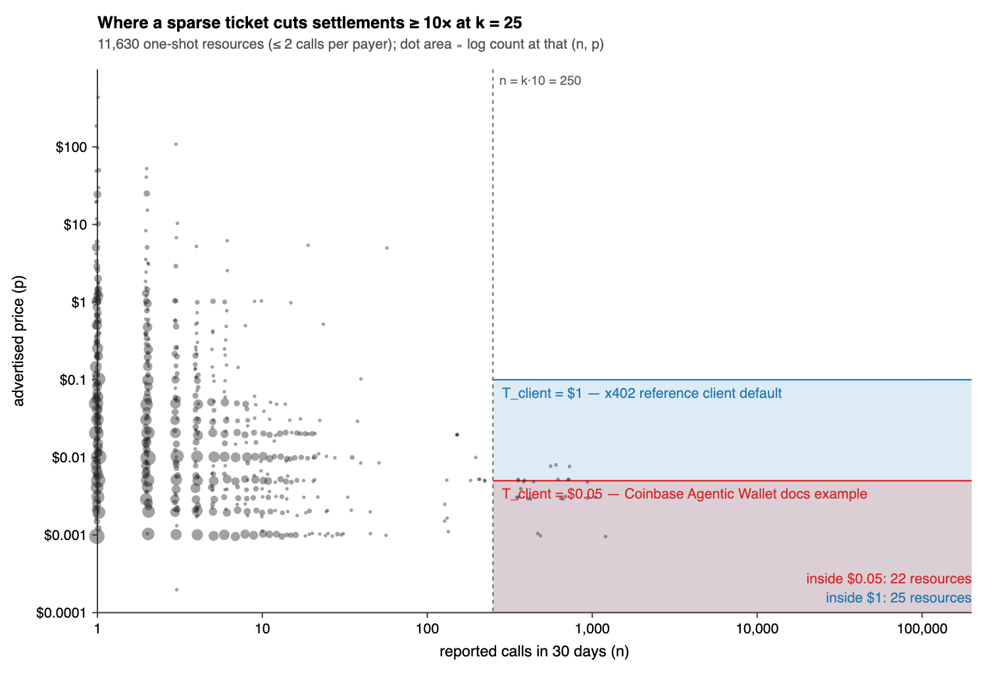

# When Not to Settle Probabilistically: Sparse Settlement and Regime Selection for x402

*Draft v0.8 — 21 September 2026 (reference rail and verifier contract with measured gas)*

> **The claim in one sentence.** The new thing is not the ticket. It is the measurement that the region where a probabilistic ticket pays is, in today's x402 market, almost empty; that three quantities the public index cannot see all move that region the same way, smaller; and that the selection rule which follows is worth more than any scheme it selects among.

## Abstract

HTTP 402 commerce is priced in cents and fractions of cents and, on its default path, settled one on-chain transfer per call. We measure the largest public index of x402 resources — 14,964 endpoints, 487,261 reported calls in thirty days — and split it by payer recurrence as well as price. The split exposes a mismatch: **between 47% and 91% of calls come from repeat payer relationships** (the range reflects an unpublished definition of "call"), yet resources advertising the schemes built for those relationships — `batch-settlement`, Circle Gateway — account for at most 4.8% of calls, and none advertises them exclusively; and at least 61% of all payer–resource pairs are provably single-call (at least 43% single-call *and* sub-cent), a cell where every efficient path in x402 begins with the buyer depositing somewhere. We construct the missing regime for that cell — *sparse settlement*, a Permit2 authorization for a ticket value *T* that settles with probability price/*T*, decided by a facilitator commit–reveal inside the request and enforced on-chain so no party can settle a losing ticket — and reduce it to four invariants independent of x402. We then measure where it applies, under four bounds: merchant variance, buyer exposure, the client's per-payment cap (**$1 by default in the x402 reference client, filtered before any policy; $0.05 in agent-wallet documentation**), and a bound prior probabilistic-payment work could ignore: the buyer's one-time Permit2 approval, which the default `exact` path does not need. The region that survives holds **25 of 11,630 one-shot resources**, is stable to the "call" definition (22–25), and in the target cell itself **4,669 of 4,716 sub-cent resources cannot beat per-call settlement at any share of returning buyers**, because merchant variance forces the ticket to the price. The useful result is therefore the selector: an ex-post oracle choosing per resource costs $94/month in settlement gas across the index against $975 for always-`exact` — a bound that trivially dominates any fixed regime — while a **deployable two-threshold rule, evaluated retrospectively, costs $107** and stays within 1.0–1.6× of the oracle across 288 combinations of gas, channel amortisation, tolerance, client cap and contract-gas premium. That rule beats the best single regime in **210 of 288** scenarios; the 78 it loses are almost all one corner — channel deposits that live six months or more, where always-channel wins — which tells the runtime the one cost parameter it must measure before choosing. *Which* single regime is best flips with the assumptions throughout. A verifier contract run against the real Permit2 bytecode settles a winning ticket in 72,829 gas (a repeat buyer) to 89,917 (a one-shot buyer's first ticket) — 0.91–1.11× a USDC EIP-3009 transfer on Base once adjusted for the token — and the one-time Permit2 approval is 0.54 of one; with those ratios the paper's cost assumptions are confirmed within 1%, every resource inside the region clears the onboarding bound even if all its buyers are new, and 4,670 of 4,716 sub-cent low-recurrence resources still never do. Probabilistic settlement is one regime among several; a merchant runtime, not a protocol, is what has to know where its edges are; and we list the three measurements that would move them.

### 要旨

HTTP 402 の商取引はセント未満で値付けされ、既定経路では 1 呼び出しにつき 1 オンチェーン送金で決済される。本稿は公開最大の x402 索引（14,964 エンドポイント、30 日で 487,261 件の報告呼び出し）を、価格だけでなく**支払者の再来性**で分割して計測する。そこで露わになるのは不整合である：**呼び出しの 47% から 91%**（幅は「call」の未公開な定義に由来する）**は反復する支払者関係から来ている**のに、その関係のための scheme——`batch-settlement`、Circle Gateway——を提示する資源は呼び出しの高々 4.8% で、専ら提示する資源は無い。一方、支払者–資源ペアの少なくとも 61% は証明可能に 1 回限りの呼び出しであり（少なくとも 43% は 1 回限りかつセント未満）、そのセルではx402 の効率的経路はすべて買い手の事前入金から始まる。本稿はそのセルに欠けている regime——*疎な決済*：券面額 *T* の Permit2 承認を確率 価格/*T* で決済し、当落はファシリテータの commit–reveal でリクエスト内に確定、外れ券は誰にも決済できないことをオンチェーンで強制——を構成し、x402 に依存しない 4 つの不変条件に還元する。次に 4 つの拘束の下でそれが適用できる範囲を測る：売り手の分散、買い手の露出、クライアントの 1 支払い上限（**x402 参照クライアントは既定 $1 で policy より前に候補を落とす。エージェントウォレット文書は $0.05**）、そして従来の確率決済研究が無視できた拘束——既定の `exact` 経路には不要な、買い手の一度きりの Permit2 承認。生き残る領域は**一回限り資源 11,630 件のうち 25 件**で、call の定義には安定（22–25）であり、対象セル内部では**サブセント資源 4,716 件のうち 4,669 件が、帰ってくる買い手の割合がいくつであっても呼び出しごとの決済に勝てない**。売り手の分散が券面を価格まで押し潰すからである。したがって有用な結果は選択器である。事後的に資源ごとに選ぶ oracle は索引全体の決済ガスが月 $94、常に `exact` なら $975——ただしこれはいかなる固定 regime にも自明に勝つ下界である。一方、**配備可能な 2 閾値の規則を遡及評価すると $107** で、ガス・チャネル償却・許容分散・上限・契約ガス割増の 288 通りにわたって oracle の 1.0–1.6 倍以内に収まる。この規則は **288 通り中 210** で最良の単一 regime に勝ち、負ける 78 通りはほぼ一箇所——預託が 6 か月以上生きる場合で、常にチャネルが勝つ——に集中しており、それは runtime が選ぶ前に測るべき唯一のコスト・パラメータを教えている。*どの*単一 regime が最良かは、仮定によって終始入れ替わる。実 Permit2 バイトコード上で動かした検証契約は、当選券を 72,829 gas（反復買い手）から 89,917 gas（一回限りの買い手の初券）で決済し——トークン差を補正すると Base の USDC EIP-3009 送金の 0.91–1.11 倍——一度きりの Permit2 承認はその 0.54 倍である。この比率では本稿のコスト仮定は 1% 以内で確認され、領域内の全資源は買い手が全員新規でもオンボーディングの拘束を越え、サブセント低再来資源 4,716 件のうち 4,670 件は依然として越えない。確率的決済は複数ある regime の一つであり、その境界を知るべきなのはプロトコルではなく売り手側ランタイムであり、本稿はその境界を動かしうる 3 つの未計測量を列挙する。

---

**Terminology.** *Channel-free* means no pre-funded balance, escrow or payment channel exists between the buyer and anyone. The buyer's ordinary wallet balance is the only backing. The *server* is not stateless: it keeps replay state and a ledger, as for `exact` today. *Reported calls* are the index's `l30DaysTotalCalls`, whose definition the index does not publish.

## 1. What the index shows, and what it cannot

We took Coinbase's public discovery index (the "Bazaar", fetched in full on 20 September 2026). Restricting to resources priced in USDC below $1,000 per call with at least one reported call gives **14,719 active priced resources**.

| | |
|---|---|
| Resources listed | 14,964 (1,989 hosts) |
| Active priced resources | 14,719 |
| Reported calls, 30 days | 487,261 |
| Median advertised price | $0.01 (p90 $0.08) |
| Resources priced below $0.01 | 41.6% |
| Resources with exactly one paying address | 69.3% |
| Offers using `upto` / `batch-settlement` / Circle Gateway batched `exact` | 2.3% / 0.15% / 0.6% |
| Gross at advertised prices | ≈ $14,000 |

### 1.1 The recurrence split

The split that has not been reported is by **recurrence** — reported calls per paying address — crossed with price. The index gives each resource's total calls and unique payers — a resource-level *mean* recurrence, not per-payer counts. We call a resource with mean ≤ 2 calls per payer **low-recurrence** and one above it **repeat**, and the cells below are cells of *resources*; the pairs column counts payers at those resources, not payers known to be one-shot:

| | Resources | Payer–resource pairs | Reported calls | Gross |
|---|---|---|---|---|
| low-recurrence, sub-cent | 4,716 (32.0%) | 23,991 (50.1%) | 27,323 (5.6%) | $97 (0.7%) |
| low-recurrence, ≥ $0.01 | 6,914 (47.0%) | 11,420 (23.8%) | 14,114 (2.9%) | $3,614 (25.8%) |
| repeat, sub-cent | 1,401 (9.5%) | 5,073 (10.6%) | 115,609 (23.7%) | $365 (2.6%) |
| repeat, ≥ $0.01 | 1,688 (11.5%) | 7,417 (15.5%) | 330,215 (67.8%) | $9,955 (70.9%) |

A mean of two calls per payer is consistent with fifty payers at two calls each or forty-nine at one and one at fifty-one; the aggregate cannot tell. But it can bound. With *n* calls over *u* payers each making at least one, at most *n* − *u* payers made two or more, so **at least 2*u* − *n* made exactly one**. Summed over the index this is a provable floor: **at least 29,388 of 47,901 payer–resource pairs (61.4%) are single-call, and at least 20,659 (43.1%) are single-call and sub-cent.** For 8,514 resources *n* = *u* exactly — every payer called once — with no inference needed. We use "one-shot" below only for these bounded quantities.

**The buyers and the calls are in different cells.** At least 43% of buyer–resource pairs are single-call and sub-cent and carry 0.7% of the money; 91% of reported calls come from repeat resources. **The cheap paths for the big cell exist and are, at most, lightly used.** The index shows what a resource *advertises*, not which scheme each call settled on. Resources advertising `batch-settlement` or Circle Gateway account for **4.8% of calls — an upper bound** on the share that could have used them — and every one of the 164 also advertises plain `exact`, so actual usage is unknown and no higher than that. This is an advertisement gap; whether it is also an adoption gap is one of the measurements §11 asks for. **The remaining gap is structural**: every efficient path begins with the buyer depositing somewhere, and a wallet that has deposited nowhere is served only by per-call `exact`.

### 1.2 Three things the index cannot tell us

Each of the statements above rests on a quantity the index does not expose. We name them now because §5–6 test the results against all three, and because they are the measurement agenda this paper leaves behind.

**(i) What a "call" is.** If only a fraction *f* of reported calls were settled payments — the rest unpaid `402` challenges — the recurrence split shifts. We apply *f* as a **stress transform, not a reconstruction**: paid calls cannot be fewer than unique paying addresses, so per resource *n*_paid = max(*u*, *f·n*).

| *f* | repeat share of calls | provable single-call floor (Σ max(0, 2*u* − *n*_paid) / pairs) |
|---|---|---|
| 1.0 | 91.5% | 61.4% |
| 0.5 | 83.7% | 78.0% |
| 0.25 | 70.7% | 85.8% |
| 0.1 | 47.3% | 90.1% |

The headline "91%" is an *f* = 1 number. The direction — most calls from repeat relationships, most buyers one-shot — holds at every *f*; the magnitude does not.

**(ii) Who the buyer is across resources, and which scheme each call used.** Recurrence is measured per resource from unique payer addresses, and scheme adoption only from what resources advertise. A buyer who calls fifty resources once each looks one-shot at every one of them, yet is a repeat buyer of the market and a natural user of a gateway balance. The one-shot cell therefore *overcounts* buyers with no efficient path.

**(iii) Whether the buyer has ever used Permit2.** The default `exact` path (EIP-3009) needs no prior transaction from the buyer. Every Permit2 path — `upto`, and the mechanism below — needs a one-time approval. The index cannot say what share of its one-shot payers have one.

All three, when resolved, push in the same direction: toward fewer resources where a probabilistic ticket is the right answer.

## 2. Background: the settlement structures x402 already has

**Who chooses.** A `402` carries `accepts[]`; **the client selects** — the reference client filters by scheme and network, then by spend controls, then by policy. This is load-bearing (§4).

**`exact` on EVM is three transfer methods.** EIP-3009 `transferWithAuthorization` (default; "simplest, truly gasless"), Permit2 via a proxy, ERC-7710 delegation. Under EIP-3009 the signature authorizes the token contract directly and anyone holding it can submit it; nothing can be interposed. Under Permit2 a proxy is sole spender and can impose conditions. **Conditional settlement is possible only in the second structure.**

**`upto`** is the existing conditional-Permit2 scheme (ceiling permit, `x402UptoPermit2Proxy`, witness binding `to`, `facilitator`, `validAfter`). §3 reuses it.

**Permit2's prerequisite.** A one-time gas-paying approval of the canonical Permit2 contract, payable by the user, sponsored by a facilitator (`erc20ApprovalGasSponsoring`), or bundled via EIP-2612 (`eip2612GasSponsoring`); otherwise `412 PERMIT2_ALLOWANCE_REQUIRED`. One approval serves every seller — but it is a transaction the EIP-3009 path never asks for.

**`batch-settlement`.** Its current EVM binding is a pre-funded per-receiver channel with cumulative vouchers. The network-agnostic specification is wider — capital-backed models including delegated authorization against a wallet balance, and credit-backed identities. "Deposit-first" describes the EVM deployment, not the scheme.

**Circle Gateway Nanopayments.** Mainnet since April 2026; one deposit into a Gateway Wallet, per-call EIP-3009-shaped authorizations against the `GatewayWalletBatched` domain, off-chain immediate credit, periodic netted on-chain settlement at Circle's gas cost; one balance pays any seller; minimum $0.000001; EOA only. Present on 116 resources in the index.

**The map.**

|  | buyer has deposited somewhere | ordinary wallet only |
|---|---|---|
| **repeat buyer** | `batch-settlement`, Circle Gateway | `exact` per call |
| **one-shot buyer** | Circle Gateway, *if the deposit came first* | `exact` per call — or nothing below a cent |

## 3. Sparse settlement in four invariants

A *sparse ticket* is a Permit2 `PermitTransferFrom` for amount *T* whose spender is a verifier contract, with witness

```
SparseWitness(address to, address facilitator, uint256 price, uint256 threshold,
              bytes32 commitment, bytes32 challengeId, uint256 validAfter)
```

The verifier enforces:

1. **Sole spender.** Only the verifier moves the funds; only `witness.facilitator` may invoke it.
2. **Conditional transfer.** `permitted.amount` moves to `witness.to` **iff** `H(s) = commitment` and `H(d ‖ s) < threshold`, where *d* is the EIP-712 digest the buyer signed and *s* the facilitator's secret. Otherwise nothing moves — a losing permit is unspendable by anyone.
3. **Advertised odds are settled odds.** `threshold` is recomputed from `price` and `permitted.amount`; mismatch reverts.
4. **One purchase, one roll.** The signature covers `challengeId`; a client MUST NOT sign a second ticket for the same `challengeId` (§7).

Expected transfer per ticket is *p*; buyer exposure is *T* with probability *q* = *p*/*T*. The commitment *c* = H(*s*) travels in the `402` challenge, so *d* covers it; *s* is revealed at `/verify`, and a winner settles inside the request against the balance just checked — the delay of a VRF round or a future block would reopen the gap between "has *T*" and "still has *T*". We hash the digest rather than signature bytes because the digest is canonical and signature bytes are not.

Whether this is a new scheme or a probabilistic EVM binding of `batch-settlement` (whose specification admits delegated wallet authorization) is a taxonomy question the paper does not depend on. The x402 field mapping is in §12.

## 4. Four bounds on the ticket

**Merchant variance.** Wins are Binomial(*n*, *q*); relative σ ≈ 1/√(*nq*). With *k* = *nq* expected wins per period, σ ≤ 20% needs *k* ≥ 25. Hence *T* ≤ *p·n/k*.

**Buyer exposure.** A buyer making *m* calls pays Binomial(*m*, *q*)·*T*. For *m* = 1, at *p* = $0.01 and *T* = $1: expected $0.01, realized "$1 with probability 1%".

**Client cap — measured, not modelled.** The x402 reference client applies spend controls as step 3 of requirement selection, before policies:

> `export const DEFAULT_MAX_AMOUNT_PER_PAYMENT: Money = "$1";`

Coinbase's agent-wallet documentation: "Max per call: Max for a single payment (e.g., $0.05)", "Agents respect these limits but can't change them." Cloudflare virtual wallets cap agent spend at an owner-set limit. So a ticket above $1 is dropped by the default client before any policy runs; a merchant can only *propose* several `accepts[]` entries at different *T* with a deterministic fallback, and the client selects.

**Onboarding — the bound the classical literature could ignore.** Rivest, Peppercoin, Orchid and Livepeer all assume the payer has an account, escrow or deposit; onboarding is outside the model. In x402 it is inside it, and asymmetric: the default `exact` path costs the buyer **no** transaction; every Permit2 path costs a first-time buyer one approval. Measured (§6): the approval is 46,403 gas and a sparse settlement 72,829–89,917, against a median 86,242 for a USDC EIP-3009 transfer on Base — ratios *a* = 0.54 and *s* = 0.91–1.11 of one `exact` settlement. Writing φ for the share of a resource's payers who are first-time Permit2 users:

  sparse beats `exact` on total gas  ⇔  φ < (*n*/*u*) · (1 − *s·p*/*T*_eff) / *a*

For a low-recurrence resource *n*/*u* ≈ 1, so the condition is roughly φ < (1 − *s·p*/*T*_eff)/*a*: sparse wins only to the extent that it actually reduces settlements, and a cheap approval (*a* = 0.54) buys it headroom. Where variance forces *T*_eff = *p*, the right-hand side is negative — a deterministic Permit2 settlement at *s* = 1.11 plus an approval never beats EIP-3009 — and it cannot win at any φ.

**The combined bound.**

  *T* = min( *p·n/k*, *T*_client, *T*_policy ),  reduction = *T*/*p*,  subject to φ < (*n*/*u*)(1 − *p*/*T*)

A ≥10× reduction needs *n* ≥ 10*k* and *p* ≤ *T*_client/10. That is a region in the (*n*, *p*) plane.

## 5. The region

**Proposition.** *At tolerance k and client cap T_client, a sparse ticket reduces settlements by at least 10× for a low-recurrence resource iff n ≥ 10k and p ≤ T_client/10; and it reduces total gas relative to per-call settlement iff, additionally, the resource's first-time-buyer share is below (n/u)(1 − p/T).*



| *T*_client | region (*k* = 25) | low-recurrence resources inside | their calls | share of index calls |
|---|---|---|---|---|
| $1 (x402 reference default) | *n* ≥ 250, *p* ≤ $0.10 | **25** of 11,630 low-recurrence | 14,839 | 3.0% |
| $0.05 (agent-wallet doc example) | *n* ≥ 250, *p* ≤ $0.005 | **22** | 12,930 | 2.7% |

**Robustness.** Relaxing to *k* = 10 admits 39 resources; tightening to *k* = 100 admits 2; demanding 50× admits none. Against the call definition (§1.2 i), the region is stable — 25 → 23 → 22 → 22 at *f* = 1, 0.5, 0.25, 0.1 — because its members are resources with hundreds of distinct payers, whose counts are not inflated by repeated unpaid probes.

**Onboarding inside the region.** For the 25 resources, at the measured ratios (*s* = 1.11 for a one-shot buyer's first ticket, *a* = 0.54) the break-even first-time share φ* has median 1.79: **all 25 beat per-call settlement even if every buyer is new.** (Under the earlier one-transaction-unit assumption for the approval, six did.)

**Onboarding in the cell the mechanism is for.** Across all 4,716 low-recurrence sub-cent resources, **4,670 have φ\* ≤ 0**: the variance bound forces *T* = *p* for 4,669 of them, the ticket reduces nothing, and a deterministic Permit2 settlement plus an approval costs more than EIP-3009 at any share of returning buyers. Thirty-nine beat `exact` with all-new buyers. In aggregate the cell's gas is $51 under always-sparse with every buyer new against $55 under `exact` — a saving carried entirely by those thirty-nine. In the cell it was built for, sparse settlement is `exact` with extra steps for 99% of resources.

This is the paper's central empirical result. The mechanism is correct; today it is almost inapplicable; and the most plausible resolutions of what the index cannot see (§1.2) each make it more so.

## 6. Regime selection

Since no single regime serves the index, the merchant runtime chooses per resource. It has the inputs — its own ledger gives *n*, *u* and recurrence — and `accepts[]` lets it propose more than one.

**Rule.** Recurring payers → a pre-funded scheme (channel, or gateway balance where the buyer has one). Low mean recurrence with *n* ≥ *k·T*_client/*p* and φ below break-even → offer sparse tickets alongside a deterministic entry, client selects. Otherwise → deterministic, sponsored, or credit-backed.

**Cost of misselection.** Gas at $0.002 per transaction; `exact` = one per call; channel = one deposit and one withdrawal per distinct payer per amortisation period plus one sweep per resource-month; sparse = *n·p/T* transfers with *T* = min($1, *p·n*/25):

| | gross | always-`exact` | always-channel | always-sparse | per-resource best |
|---|---|---|---|---|---|
| low-recurrence, sub-cent | $97 | $55 | $105 | $23 | $23 |
| low-recurrence, ≥ $0.01 | $3,614 | $28 | $60 | $27 | $27 |
| repeat, sub-cent | $365 | $231 | $23 | $27 | $17 |
| repeat, ≥ $0.01 | $9,955 | $660 | $33 | $50 | $27 |
| **index** | **$14,032** | **$975** | **$221** | **$127** | **$94 (oracle)** |

**$94 is an oracle, not a selector — and an oracle cannot lose.** It picks, for each resource, the regime that was cheapest over the same thirty days it is scored on. Under any additive cost model Σᵢ minᵣ Cᵢᵣ ≤ minᵣ Σᵢ Cᵢᵣ holds identically, so "the oracle beats every fixed regime" is arithmetic, not evidence. We report it only as the bound. The evidence is what a **deployable rule** does — one with thresholds a merchant can set in advance and hold fixed: *mean recurrence > 2 → channel; else ≥ 100 payers and p ≤ $0.10 → sparse; else `exact`*. **Evaluated retrospectively** on the same window (its inputs *n*, *u* are the month's realised values; a true out-of-sample test needs the second snapshot of §11), it costs **$107**, 1.14× the oracle. Fed *forecasts* of *n* and *u* perturbed by lognormal noise instead of realised values, it costs $102 / $114 / $127 at typical errors of ±65% / ×÷2.7 / ×÷4.5.

With first-time approvals charged to the sparse column (sponsored or not, someone pays): always-sparse rises to $175 at φ = 0.5 and $223 at φ = 1; per-resource selection to $116 and $135. **Selection beats always-`exact` by 7.2× even if every sparse buyer is new**, because the saving comes from routing repeat traffic to channels, not from sparse.

**Does the deployable rule survive the cost model?** Its thresholds were fixed at the central assumptions and *not* re-tuned. Sweeping gas ($0.0005 / $0.002 / $0.01), channel amortisation (1 / 3 / 6 / 12 months), *k* (10 / 25 / 100), client cap ($0.05 / $0.10 / $1 / $5) and a 1× / 2× contract-gas premium — 288 scenarios — at three call fractions:

| *f* | rule beats best single regime | best-single / rule (min / median / max) | rule / oracle (min / median / max) | rule vs always-`exact` (median) |
|---|---|---|---|---|
| 1.0 | **210 / 288** | 0.68× / 1.26× / 2.66× | 1.02× / 1.19× / 1.62× | 11.9× |
| 0.25 | 201 / 288 | 0.69× / 1.37× / 2.48× | 1.00× / 1.18× / 1.60× | 4.2× |
| 0.1 | 183 / 288 | 0.69× / 1.21× / 2.23× | 1.00× / 1.19× / 1.63× | 2.4× |

The rule is never more than 1.6× the unreachable oracle, and never worse than 1.47× the best single regime when it loses. **Where it loses is the finding.** Of the 78 losses at *f* = 1, 72 are scenarios where channel deposits amortise over six or twelve months — there a deposit is so cheap that always-channel beats a rule that still routes 12,453 low-volume resources to `exact`. The rule's recurrence threshold is right for month-lived deposits and wrong for year-lived ones. That is not an argument against selection; it says the selector has one cost parameter it must measure rather than assume — **how long a buyer's deposit actually lives** — and the merchant's own ledger is where that number accumulates. Meanwhile the identity of the best *single* regime flips between channel and sparse across the sweep (120/24 at *f* = 1, 72/72 at *f* = 0.1): a merchant who commits to one scheme on principle is committing to a parameter regime it has not measured.

**Contract-path gas, measured.** A sparse settlement is a Permit2 proxy call with a witness, not a bare EIP-3009 transfer. Rather than assume a premium, we wrote the verifier (`packages/sparse/contracts/SparseSettlementProxy.sol`, a fork of `x402UptoPermit2Proxy`'s structure enforcing invariants 1–3) and ran it in an in-process EVM (Cancun) with the **real Permit2 runtime bytecode** from Base at its canonical address, tickets signed as a wallet signs Permit2 typed data:

| | gas | |
|---|---|---|
| USDC `transferWithAuthorization` on Base (EIP-3009), median of 12 recent txs | **86,242** | the reference |
| sparse settle, winner, repeat buyer (warm nonce word, funded payee) | 72,829 | 0.84× on a mock token; **≈ 78,771, 0.91×** with USDC's own transfer overhead added (5,942 gas: USDC `transfer()` median 40,271 vs the mock's 34,329) |
| sparse settle, winner, one-shot buyer's first ticket (cold nonce word, funded payee) | 89,917 | **≈ 95,859, 1.11×** USDC-adjusted — the case the mechanism is for |
| sparse settle, `upTo` route fulfilled at 1/10 of the signed price | 72,777 | odds fall at settle time; no extra cost |
| sparse settle, loser | 39,186 | reverts `NotAWinner`; never submitted |
| Permit2 approval, one-time per buyer | 46,403 | **0.54×** an EIP-3009 transfer — bound (iv) |
| wrong caller · price above signed · wrong secret · inflated threshold | — | all revert; the same ticket then settles |

Re-running the cost table with these ratios instead of 1× changes it by under 1%: always-sparse $126, oracle $93, the fixed rule $108. The sweep's 1× / 2× bracket holds the measured 0.91–1.11×. Under a hypothetical 2× / 3× premium, always-sparse would be $255 / $382 and selection's margin over the best single regime would *widen* to 2.00× / 2.50×, because `exact` is the only regime a contract premium does not touch; calls routed to sparse stay at 44–45% throughout.

**The channel column is a worst case.** It models x402's per-receiver EVM channel. A gateway-style deposit — one per buyer, shared across every seller — costs (distinct buyers × 2 × gas)/amortisation. The index cannot count distinct buyers across resources (§1.2 ii); bounding by payer pairs, if buyers use on average 1 / 5 / 20 resources, gateway-style channel gas is $221 / $68 / $39 index-wide, against always-sparse's $127. Beyond about five resources per buyer, a gateway beats sparse everywhere.

## 7. Threat model

**Biasing *s*.** The facilitator commits before seeing *d*, the buyer signs before seeing *s*; neither biases alone. Collusion can only decline to pay (invariant 1). **Grinding**: *d* is fixed before the reveal and covers *c*. **Selective abort**: having *d*, the facilitator knows a loss before the buyer does and could answer "verification failed" with a fresh commitment; an auto-retrying client would re-roll until it loses, turning *q* into 1 — no funds taken wrongly, but expected cost per *attempt* rises to *p*. The defence is normative: **a client MUST NOT sign a second ticket for the same `challengeId` after a verification that did not reveal *s* against the commitment it signed**; non-reveal is a facilitator fault, not a retriable error. **Safety versus liveness.** The rule above forbids a *new signature* for the same `challengeId`; it does not forbid *resubmitting the same ticket*. A client that cannot tell a malicious non-reveal from a dropped response resubmits the identical signed payload: it is idempotent, the facilitator must reveal *s* against the same commitment, and the same digest gives the same outcome — no re-roll is possible. Network faults therefore cost nothing. A facilitator that never reveals blocks the purchase, which is the same liveness a facilitator that never verifies gives `exact` today, and the buyer's recourse is the same: another facilitator, or none. What the buyer loses relative to `exact` is the option to *re-sign* on ambiguity, which is exactly the option the re-roll attack needs. **Settling a loser**: invariants 1–3. **Insolvency at a win**: resolution inside the request; the residual race is `exact`'s. **Replay**: a losing permit's nonce is unconsumed on-chain, so the runtime records it as used at verification. **DoS**: an unacceptable ticket is filtered client-side and costs nothing; an unpaid request costs a verification and a commitment, as today. **Leakage**: wins are public at resolution *T*.

## 8. Characterisation, accounting, legal

**Economic.** Both parties' expected value equals the price; no house, no edge; a settlement mechanism, not a product.

**Accounting.** Expected value and realized cash are reported separately; the difference is not a receivable; financial-statement recognition is out of scope.

**Legal.** Whether a payment with a random settlement outcome is a game of chance is a question of jurisdiction, and the absence of a house edge does not settle it. In a deployment where agents sign such authorizations automatically, this is plausibly the largest pre-launch risk, and terminology does not address it. We make no legal claim; a jurisdictional analysis by someone qualified is a prerequisite to charging real money. What the *design* can do is narrow the surface, and the reference implementation (§12) does all of it: a sparse entry is never offered alone — a deterministic `accepts[]` entry is always present; the ticket has no prize, no edge and no variable payout — it is *T* or nothing at exactly *p*/*T*; the merchant can disable the regime per resource; and the client's own cap filters it before the buyer sees it.

## 9. Related work

| System | Buyer pre-funds? | Enforcement | Randomness | Resolved |
|---|---|---|---|---|
| Wheeler 1996; Rivest 1997 | no; bank credential | trusted bank | vendor commit / beacon | at request / later |
| Micali–Rivest 2002; Peppercoin | no; bank or card account | bank / PSP | deterministic merchant signature | at request |
| Pass–shelat 2015 | escrow | contract | VRF / commit | at request |
| Orchid 2019 | deposit + balance, global | Ethereum contract | keccak(reveal, nonce) ≤ ratio | at request |
| Livepeer PM | deposit + per-round reserve | `TicketBroker` | keccak(senderSig, recipientRand) | at receipt |
| MicroCash 2020 | payment + penalty escrow | miners; penalty burn | future block + VDF | later |
| `emc-randpay-x402` 2026 (draft) | no; per-attempt L1 tx | none on-chain; demo uses local RNG | server entropy | at request |
| Circle Gateway 2026 | Gateway balance, global | Circle (TEE batches) | none | off-chain immediate |
| x402 `batch-settlement`, EVM | per-receiver channel | contract | none | claim then sweep |
| **Sparse** | **no — wallet + Permit2 approval** | **Permit2 verifier** | **facilitator commit, buyer digest** | **inside the request** |

Probabilistic micropayments are thirty years old; bringing them to x402 has been proposed, including a 2026 draft whose demo decides wins off-chain. Among the systems and specifications we reviewed we did not find a prior construction combining no pre-funded account, ordinary wallet funds, on-chain-enforced probabilistic outcome, in-request resolution and an x402 flow — and we rest nothing on that. What the paper rests on is independent of the mechanism's adoption: the recurrence split and its *f*-range (§1); the client cap and the onboarding cost as bounds the classical literature could omit (§4); the measured region and its stability (§5); and selection over invention (§6).

## 10. Cheap settlement does not create demand

If sub-cent resources were unsold because settlement costs too much, cutting that cost should unlock them. The index says otherwise. Sub-cent and cent-plus resources have the same median traffic (2 calls a month), the same median payer count (1) and nearly the same share of single-payer resources (67.5% vs 70.5%). And the one-shot buyer's dominant cost was never the per-call settlement — under EIP-3009 the buyer pays no gas at all. It is the onboarding the Permit2 paths add: at the median sub-cent price of $0.002, one approval equals one purchase, amortising below 10% of spend only after about ten purchases, and the median buyer in that cell makes one. Whatever suppresses one-shot sub-cent traffic — discovery, trust, wallet onboarding, spend caps — it is not priced in settlement gas, and a mechanism that lowers settlement gas should not be expected to raise it.

## 11. What has to be measured next

The three quantities of §1.2 are not limitations to apologise for; they are the measurements that decide whether any of §5's boundaries move. **(i)** The index operator can say what a "call" is. **(ii)** Cross-resource payer identity is recoverable from on-chain settlement transactions for `exact`, since the payer address is public — a study we have not done. **(iii)** The Permit2-approval rate among x402 payers is likewise on-chain. **(iv)** Which scheme each call actually settled on, for resources advertising more than one, is visible to facilitators and partially on-chain (Gateway batches versus per-call transfers). **(v)** A second index snapshot with a disjoint thirty-day window turns the retrospective rule of §6 into an out-of-sample test — thresholds fixed on September, cost scored on October; we have scheduled one. **(vi)** The lifetime of a buyer's channel or gateway deposit, which §6 shows is the single cost parameter that decides whether a recurrence-threshold rule or always-channel is right; it is observable from `x402BatchSettlement` and Gateway contract events. Until they are measured, the honest reading of every number here is the direction, not the magnitude — and all three directions point the same way.

Other limitations: the gas figures come from an in-process EVM on a minimal ERC-20 with the real Permit2 code, adjusted for USDC's transfer overhead, not from a mainnet deployment; the verifier is unaudited and undeployed; the $0.002-per-transaction unit is still an assumption; the channel model is the per-receiver worst case (§6); client caps are three data points, not a survey; recurrence from unique addresses misreads rotated and shared addresses; sparse excludes EIP-3009 structurally and ERC-1271 unless added; the legal question is open.

## 12. Next steps

1. **Reference rail, off-chain — done.** `@tollstile/sparse` (private, experimental) implements the rail on `createRail`, with an in-memory facilitator doing commit–reveal, signature and threshold checks, balance checks and idempotent settlement. It passes the runtime's nine-case rail conformance suite and eighteen mechanism tests: expected versus realized over 400 tickets, odds enforcement (invariant 3), witness binding, digest tampering, single-use of a losing ticket whose nonce never reached the chain, insufficient balance and two tickets against one balance (exactly one settles), the selective-abort case with the retry rule (same ticket resubmitted → same loss; fresh signature for the same `challengeId` → `challenge_consumed`), `upTo()` settlement at the charged price's odds, a lost settle response resolved by lookup once, and the §6 rule against the paper's own numbers. Its reason to exist is to put the ledger semantics and the selection rule under test, not to charge with it.
2. **x402 binding.** `accepts[].extra` carries `ticket`, `price`, `commitment`, `challengeId`, `facilitatorAddress`; payload is the Permit2 permit over the witness; `/verify` reveals *s* and returns the outcome; `/settle` submits winners and returns `amount: 0` with an empty transaction for losers, as `upto` already permits; the client rule of §7 goes in the MUSTs.
3. **Verifier contract — written and measured, not audited or deployed.** `SparseSettlementProxy.sol` enforces invariants 1–3 on-chain (sole spender; transfer iff `keccak256(s) = commitment` and the roll is below the threshold; threshold recomputed from price and `permitted.amount`; settle-time price at or below the signed price). `pnpm --filter @tollstile/sparse gas` compiles it, runs it against the real Permit2 bytecode and prints §6's table; `research/sparse-settlement/gas-benchmark.json` holds the run. Next: audit, and the live measurement on Base Sepolia with the buyer-side distribution.
4. **The measurements of §11**, then re-run §5. The region is a function of the market, not the mechanism.

## 13. Conclusion

x402 settles isolated payments well, and repeat relationships well for buyers who deposit first. Its index is mostly buyers who have not deposited and mostly calls from those who have, and the schemes built for the second group are almost unused. Sparse settlement closes the smaller gap with a channel-free, on-chain-enforced probabilistic ticket resolved inside the request; we did not find a prior construction of that shape and rest nothing on it. Its benefit is bounded four ways — merchant variance, buyer exposure, a per-payment cap already shipped in the reference client, and an onboarding transaction the default path never asks for — and crossing those bounds with real traffic leaves 25 resources of 11,630, while in the cell it was built for, 99% of resources gain nothing at any share of returning buyers. The output is therefore the boundary, not the ticket: a merchant runtime that measures recurrence, volume and the client's cap, chooses per resource, and — because the best single scheme flips with assumptions the market has not yet measured — refuses to commit to one.

---

*Reproducibility.* Index fetched 2026-09-20 from the CDP Bazaar public discovery API (150 pages of 100). Population: 14,719 resources whose first offer is priced in a known USDC contract below $1,000 with ≥ 1 reported call; recurrence = `l30DaysTotalCalls / l30DaysUniquePayers`. Gas: `packages/sparse/scripts/gas-benchmark.ts` (solc 0.8.37, @ethereumjs/vm, Cancun, chainId 8453, Permit2 runtime bytecode read from Base on 2026-09-21), output in `gas-benchmark.json`; EIP-3009 and USDC `transfer()` references from Base mainnet receipts on 2026-09-21. Scripts: `sparse-analytic.mjs`, `quadrant.mjs`, `buyer-side.mjs`, `region2.mjs` (figure), `misselect.mjs`, `sensitivity.mjs`, `callfrac.mjs`. Gas $0.002 per transaction; approval priced at one transaction. Specification quotations from `x402-foundation/x402` at main, 2026-09-20 (`typescript/packages/core/src/client/x402Client.ts`); Circle from developers.circle.com and Coinbase agent-wallet FAQ from docs.cdp.coinbase.com, 2026-09-21. The fetched index, all scripts and their outputs accompany this draft as `sparse-settlement-artifact.tar.gz`; a second snapshot for §11(v) is planned for late October 2026.
